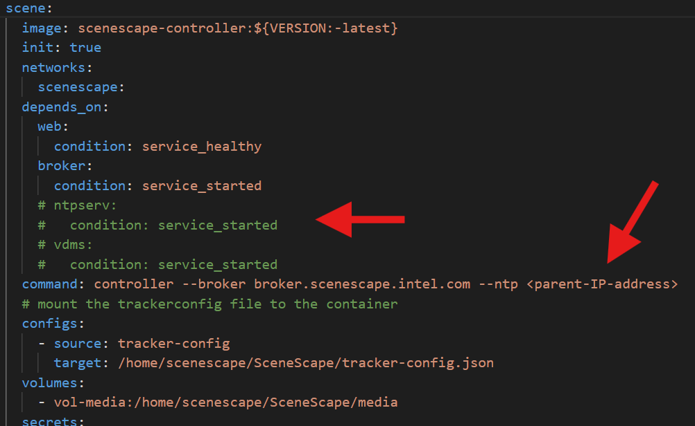
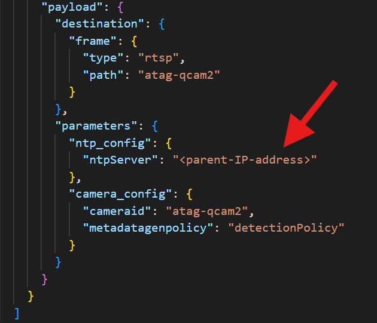

# How to Create and Manage a Scene Hierarchy in Intel® SceneScape

A hierarchy of scenes can be created using a parent-child relationship, enabling scene analytics from multiple scenes—whether on the [same system](#steps-to-add-a-local-child-scene) or [different systems in same network](#steps-to-add-a-remote-child-scene) running Intel® SceneScape—to be visualized within a single parent scene. This hierarchy is not limited to a single level of relationship; it can be scaled upwards, allowing for multi-level parent-child configurations. By subscribing to the parent scene's events, you can observe the base analytics (such as regions of interest, tripwires, and sensors) of the parent scene, along with the transformed base analytics of all its child scenes, directly within the parent scene.

This guide provides step-by-step instructions to add local and remote child scenes, configure connections, and manage object tracking and update fidelity in a scene hierarchy. By completing this guide, you will:

- Add and validate child scene links (local and remote).
- Configure secure communication between systems.
- Tune retrack and temporal fidelity options.

This task is essential for managing distributed scenes in Intel® SceneScape deployments.

## Prerequisites

- **Installed Dependencies**: Intel® SceneScape deployed on both systems.
- **Network Access**: Verify systems can resolve each other's IP/hostname.
- **Permissions**: Ensure access to modify `docker-compose.yml` and certificates.

---

## Steps to Add a Local Child Scene

1. **Launch the Intel® SceneScape UI and Log In**.
2. Navigate to the parent scene.
3. Click the **Children** tab under the scene map.
4. Click **+ Link Child Scene**.
5. Set **Child Type** to `Local`.
6. Select the scene to be added from the dropdown list.
7. Enter transform type and values.
8. Click **Add Child Scene**.

**Expected Result**: The child scene appears in the parent scene view.


_Figure 1: Creating new local child scene link._


_Figure 2: Local Child scene on scene detail page._

---

## Steps to Add a Remote Child Scene

### 1. Configure NTP for Synchronization

**On Parent System**:

- Edit `docker-compose.yml` to uncomment NTP server port.


**On Child System**:

- Edit `docker-compose.yml` to uncomment MQTT broker port.


- Disable NTP server service in `docker-compose.yml`.
- Replace `ntpserv` with parent IP in dependent services.



_Figure 3: ntpserver config for scene controller service in `docker-compose.yml`._


_Figure 4: comment ntpserver for DL Streamer pipeline server in `docker-compose.yml`._



_Figure 5: ntpserver config for DL Streamer pipeline in `pipeline-config.json`._

> **Note**: Use [sample_data/docker-compose-dl-streamer-example.yml](https://github.com/open-edge-platform/scenescape/blob/main/sample_data/docker-compose-dl-streamer-example.yml) if `docker-compose.yml` doesn’t exist.

### 2. Set Up Secure Communication

**On Parent system**:

```bash
./deploy.sh
docker compose down --remove-orphans
rm manager/secrets/ca/* manager/secrets/certs/*
make -C tools/certificates/ deploy-certificates CERTPASS=<random-string>
```

**On Child system**:

> **Note**: Ensure that there are no scenes with the same UUID present on both the parent and child systems.

```bash
./deploy.sh
docker compose down --remove-orphans
rm manager/secrets/ca/* manager/secrets/certs/*
# Copy parent secrets:
scp parent:/path-to-scenescape-repo/manager/secrets/ca/scenescape-ca.key ./manager/secrets/ca/
scp parent:/path-to-scenescape-repo/manager/secrets/certs/scenescape-ca.pem ./manager/secrets/certs/
# Use the same CERTPASS from parent
 make -C tools/certificates/ deploy-certificates IP_SAN=<child_ip> CERTPASS=<random-string-used-in-parent>
```

Then restart Intel® SceneScape:

```bash
./deploy.sh
```

### 3. Link Remote Child

1. Open the child system's Intel® SceneScape UI and copy the MQTT credentials.
2. Open the parent system's Intel® SceneScape UI.
3. Go to the **Children** tab in parent scene.
4. Click **+ Link Child Scene**.
5. Select `Remote` as child type and enter:
   - Child Name
   - Hostname or IP
   - MQTT Username/Password
   - Transform type/values
6. Click **Add Child Scene**.


_Figure 5: Creating new remote child scene link._


_Figure 6: Remote child scene on scene detail page._

**Expected Result**: Remote child is listed with green/red status icon.

> **Note**: Scene names must be unique across parent and child systems.

---

## Retrack Objects in Parent Scene

- Open the child link config in the UI.
- Toggle the **Retrack** option:
  - **Disabled**: Treat detections as already tracked.
  - **Enabled**: Feed detections into the parent tracker.


_Figure 7: Toggle to re-track moving objects from child scene._

---

## Set Temporal Fidelity of Scene Updates

- Navigate to the scene configuration.
- Configure the following:
  - `Regulate Rate (Hz)`: Limit updates to internal UI.
  - `Max External Update Rate (Hz)`: Limit updates to parent/consuming systems.


_Figure 8: Set Regulate and External Update rate in scene config._

---

## Re-identification Support in Hierarchy

- Re-identification is **scene-local** only.
- Child scene objects retain UUIDs within their own scene.
- Parent scene does **not** re-identify child objects.

> Refer to [Re-identification Guide](How-to-enable-reidentification.md) for more details.
