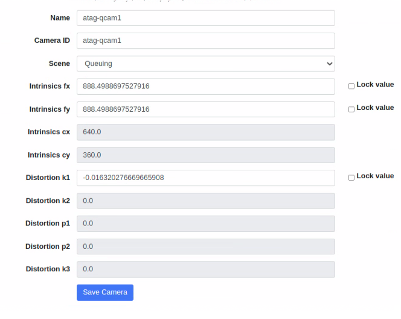

# How to Manually Calibrate Cameras in Intel® SceneScape

This guide provides step-by-step instructions to manually calibrate cameras in Intel® SceneScape. By completing this guide, you will:

- Configure camera intrinsic parameters using `docker-compose.yml`.
- Use 2D UI tools to align views with map data.
- Understand advanced calibration options such as focal length estimation.

This task is essential for accurate spatial positioning and analytics in Intel® SceneScape. If you’re new to Intel® SceneScape, see [Intel® SceneScape README](https://github.com/open-edge-platform/scenescape/blob/release-1.4.0/README.md).

## Prerequisites

Before You Begin, ensure the following:

- **Installed Dependencies**: Intel® SceneScape deployed by running `./deploy.sh`.

- **Access and Permissions**: Ensure you have appropriate access to edit configuration files or interact with the UI.

## Steps to Manually Calibrate Cameras

### 1. Calibrate Using 2D User Interface

1. Log in to Intel® SceneScape.
2. You will be presented with a Scenes page. Click on a scene.
3. Once a scene clicked, click on a camera to calibrate.
4. You will see 2 view ports, a camera view port and map view port. Both view ports will have at least four matched point sets.
   > **Notes:**
   >
   > - Both views support panning by clicking and dragging the mouse and zooming by scrolling the mouse wheel.
   > - To add a point to a view, double click on a valid location in the view.
   > - To remove a point, right click on the point.
   > - To move a point, click and drag the point to the desired location.
5. Adjust the points to refine the camera's alignment with the scene.
6. Click **Save Camera** to persist the calibration.
7. Use **Reset Points** to clear all points (if needed).
   > **Notes:**
   >
   > - To add new points after clicking reset, refer to the instructions in step 4 above.
   > - You must reset points if the scene map, translation, or rotation changes.

**Expected Result**: The projection aligns with the scene based on user-defined calibration.

### 2. Use Advanced Calibration Features

When six or more point pairs exist:

1. Uncheck the lock value boxes next to `Intrinsics fx` and `Intrinsics fy` to unlock focal length estimation.
2. Once the values are unlocked, the focal length will be estimated when adding and dragging calibration points.
3. To set values manually, enter them directly and re-check lock value boxes to prevent overwriting.

**Expected Result**: Accurate focal length estimates update in the UI.

When eight or more point pairs exist:

1. Uncheck the lock value box next to `Intrinsics fx`, `Intrinsics fy` and `Distortion K1` to unlock focal length and distortion estimation.
2. Once the values are unlocked, the focal length and distortion (k1) will be estimated when adding and dragging calibration points.
3. To set values manually, enter them directly and re-check lock value boxes to prevent overwriting.

**Expected Result**: Accurate focal length and distortion (k1) estimates update in the UI.
**Note**: Computing distortion is unavailable as the Video Analytics service transitions to using DLStreamer Pipeline Server. File an issue on GitHub with information on proposed usage and priority against other features.

_Figure 1: Computed Camera Intrinsics_

### 3. Calibration Best Practices

When calibrating cameras in Intel® SceneScape, follow these best practices for optimal results:

- **Distribute Points Evenly**: Place calibration points across the entire field of view, not just in one area.
  

  _Figure 2: Evenly Distributed Calibration Points_

  

  _Figure 3: Poorly Distributed Calibration Points_

- **Avoid Collinear Points**: Avoid having any 3 points being collinear, as it creates an under-constrained problem and lead to inaccurate calibration results.
  

  _Figure 4: Collinear Calibration Points_

- **Aim for 8+ Point Pairs**: More point pairs generally produce better calibration results.
- **Re-calibrate After Camera Movement**: Any physical camera adjustments require recalibration.

For challenging scenes, consider using physical calibration targets in the environment before capturing footage.

## Supporting Resources

- [Step-by-step guide to 3D camera calibration](How-to-use-3D-UI.md#step-3-calibrate-the-camera)
- [Intel® SceneScape README](https://github.com/open-edge-platform/scenescape/blob/release-1.4.0/README.md)
