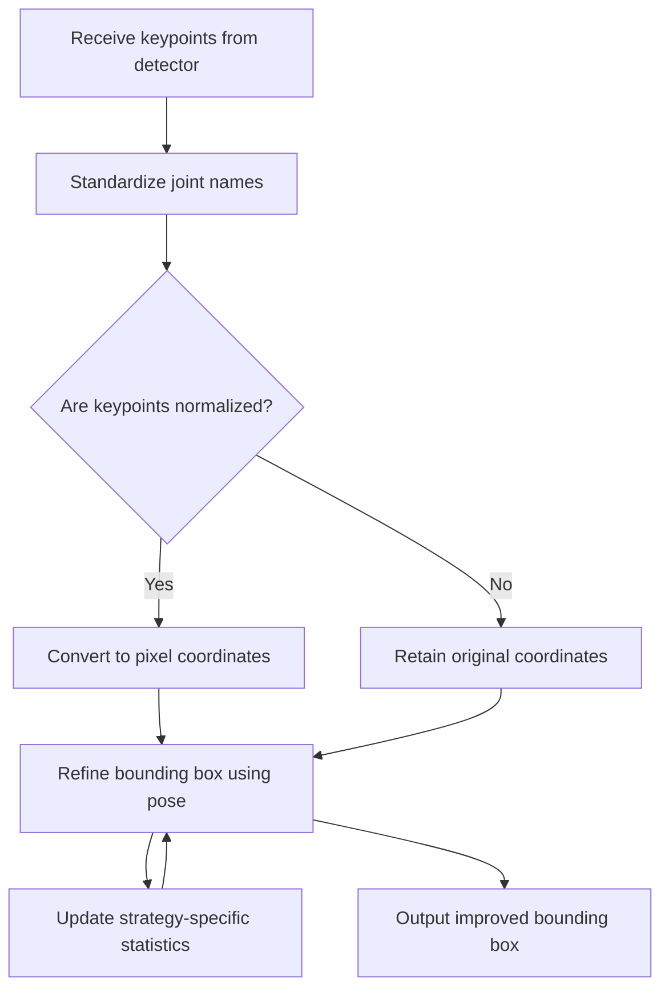

<!--
SPDX-License-Identifier: Apache-2.0
(C) 2026 Intel Corporation
-->

# Pose Adjustment Package Design

## Overview

The `pose_adjustment` package in the SceneScape Controller microservice provides utilities for refining detections using pose keypoints and learned spatial proportions. It is organized around a strategy-based coordinator so additional detection types can plug in their own pose-adjustment behavior.

## Flowchart: Pose Adjustment Pipeline



## Key Behaviors and Components

- **Bounding box refinement**: Adjusts detected regions using pose keypoints and learned spatial proportions, resulting in more accurate localization.
- **Keypoint normalization and scaling**: Converts incoming keypoints from various formats to a standard set of landmark names, and scales them to the appropriate coordinate system (pixel or normalized) as needed.
- **Spatial proportion statistics**: Maintains adaptive statistics about landmark-to-landmark proportions for each tracked object, using recent observations to improve future bounding box adjustments.

## Design Details

### 1. Keypoint Standardization and Preparation

- Joint names from different sources are mapped to a standard set of names, ensuring consistency regardless of the input format.
- Incoming keypoints are parsed and the most reliable observation for each joint is selected.
- Keypoints are checked to determine if they are normalized (values between 0 and 1) and, if so, are scaled to pixel coordinates using either the bounding box or the frame resolution.

### 2. Learning and Using Spatial Proportions

- Each strategy tracks median spatial proportions between characteristic landmarks for each tracked object, keyed by a unique identifier (e.g., camera, track ID, label).
- A rolling window of recent samples is maintained per ratio, along with detection and observation counts and a last-seen timestamp.
- Stale entries are pruned, and learned medians are only applied once enough observations have been collected to ensure reliability.

### 3. Refining Detection Localization

- The system uses pose keypoints and learned spatial proportions to refine the detected region for supported detection types.
- It supports both direct observation and estimation methods for determining the anchor point position, applies safety margins, and adapts its approach based on the confidence of the keypoint data.
- The behavior can be tuned with parameters such as the number of samples to remember, how long to keep statistics, and how many observations are needed before using learned proportions.

## Usage Pattern

1. Parse and standardize incoming keypoints from the detector.
2. Scale keypoints to the appropriate coordinate system if needed.
3. Resolve detection type routing with exact label lookup first, then optional configured route labels.
4. Invoke the resolved strategy, which refines the bounding box and updates the spatial proportion statistics for future improvements.

### Detection Type Routing Configuration

The coordinator supports optional file-based routing rules loaded from the controller's `pose-adjustment-route.json` configuration.
The file maps a canonical strategy label to the list of incoming labels that should dispatch to it.

Example:

```json
{
  "person": ["human", "pedestrian"],
  "vehicle": ["car", "truck", "sedan"]
}
```

Dispatch order is deterministic:

1. Try exact detection label.
2. Try any configured route label that maps to a registered strategy.

Resolved routes are flattened once during initialization, so recurring labels do not pay additional routing cost during message processing.

## Extensibility

- The package is designed to be extensible: new detection types can be supported by implementing the `PoseAdjustmentStrategy` protocol and registering the strategy with the `PoseAdjustment` coordinator. The shared `core/` utilities (bbox geometry, rewrite policy) are available for reuse by any strategy.

## See Also

- [controller.md](../../../../docs/user-guide/microservices/controller/controller.md): Controller service overview
- [data_formats.md](../../../../docs/user-guide/microservices/controller/data_formats.md): Data formats and keypoint message structure
